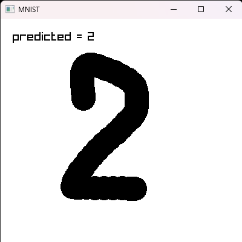

# Overview

This is a MNIST handwritten digit recognizer written in zig with raylib.

# Installation

Install raylib first for GUI

```
git clone https://github.com/raysan5/raylib.git --single-branch --depth 1
```

For training you also need MNIST data from [here](http://yann.lecun.com/exdb/mnist/).

Place it in data folder and use `src/main_training.zig`

# Two implementations

One implementation is in pure zig `src/main_pure.zig` - neural network training.

Second implementation is in C `src/main.zig` exported from tensorflow.

Both implementations are a bit stupid.

# Screenshot

